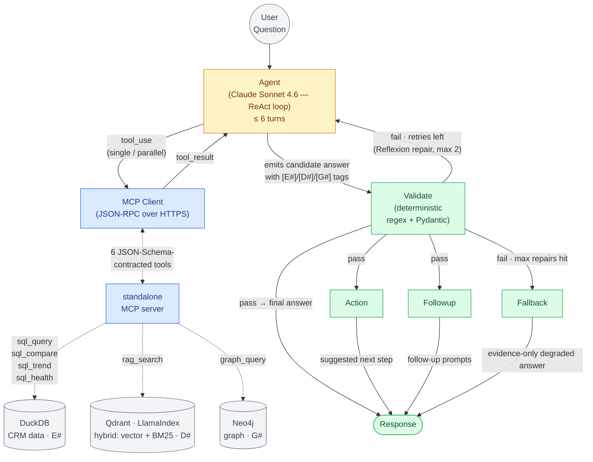
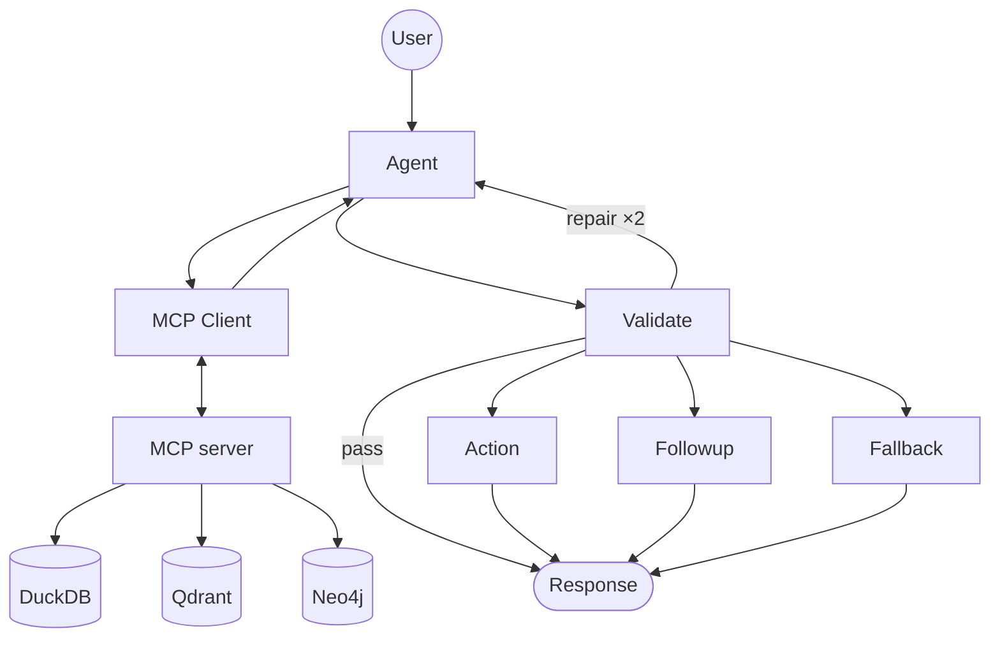
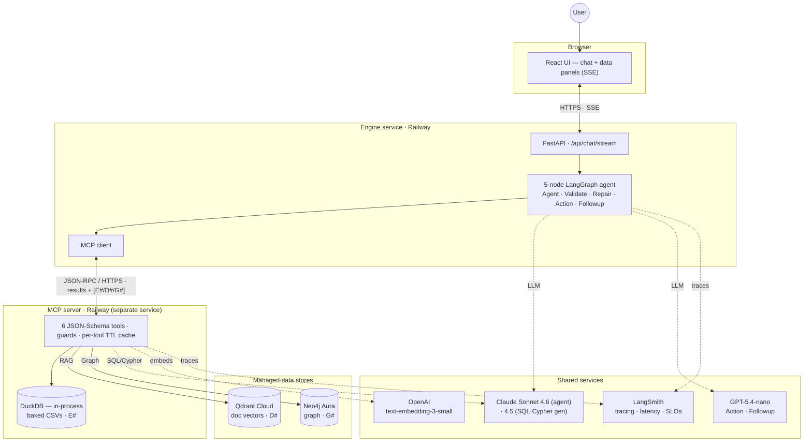
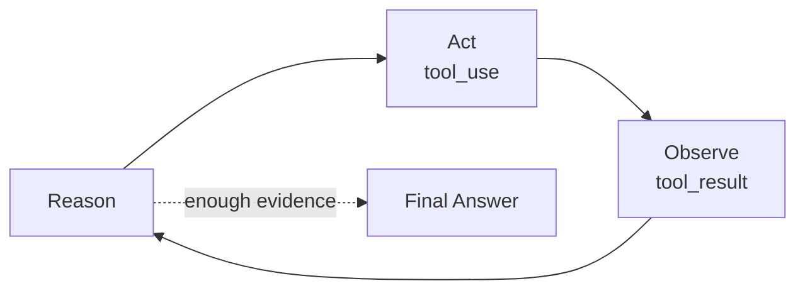
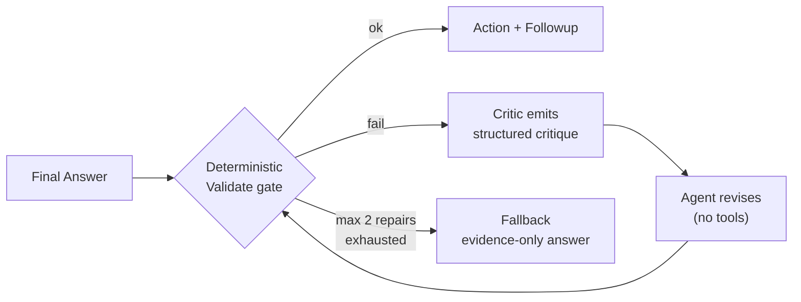
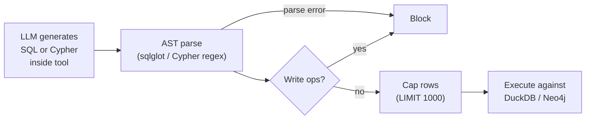
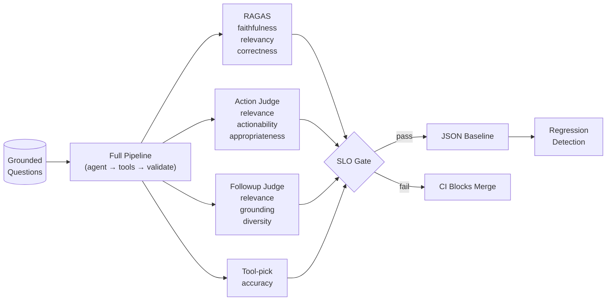

# CRM Agentic Reasoning Engine

**Tool-use agent (Claude Sonnet) backed by a standalone MCP server that reasons across CRM data, product documentation, and a knowledge graph — with grounded answers, traceable evidence, and quality gates.**

[](https://www.python.org/)
[](https://modelcontextprotocol.io/)
[](https://github.com/langchain-ai/langgraph)
[](https://www.llamaindex.ai/)
[](https://neo4j.com/)
[](https://github.com/explodinggradients/ragas)

---

## The Problem

An account manager prepping Acme's renewal asks: *"Acme's renewal is at risk — which Act! Marketing Automation features are they under-using, what does the documentation recommend for those features, and who on their buying committee should I prioritize, excluding anyone connected to our competitors?"*

This one question touches three sources — CRM data (feature usage, renewal status), product docs (recommendations for under-utilized features), and the knowledge graph (buying committee, competitor connections). Each baseline falls short for a different reason — pure LLMs hallucinate, LLM + RAG over a single corpus misses cross-cutting context, and direct SQL can't reason over docs or graph relationships.

**This system is a LangGraph ReAct (Reason+Act) tool-use agent backed by a standalone MCP server.** The agent (Claude Sonnet 4.6) decomposes cross-source questions via parallel tool calls, broadens retrieval when evidence is thin, and synthesizes one coherent answer with traceable per-source citations (`[E#]` for SQL, `[D#]` for docs, `[G#]` for graph). A deterministic Validate gate enforces an evidence-tag contract with Reflexion-style repair on any ungrounded claim.

---

## Architecture



<details>
<summary><b>Architecture at a glance</b> — the spine (full detail above)</summary>



</details>

**5-node LangGraph + 1 standalone MCP server.** Two products from one codebase: the engine (web UI surface) consumes the MCP server over HTTP/SSE; the same MCP server is independently demoable in Claude Desktop via stdio. Six JSON-Schema-contracted tools serve as the protocol surface — `sql_query`, `sql_compare`, `sql_trend`, `sql_health`, `rag_search`, `graph_query` — over DuckDB, LlamaIndex, and Neo4j.

> Examples: "Show Q1 deals" → `sql_query` · "Q1 vs Q2 revenue" → `sql_compare` · "Revenue trend by month" → `sql_trend` · "Acme's health score" → `sql_health` · "How do I import contacts?" → `rag_search` · "Who is connected to our competitors?" → `graph_query` · "Acme renewal: under-used features + doc recommendations + committee minus competitors?" → **parallel calls to sql_query + rag_search + graph_query** (cross-source).

### Deployment & system topology

The same logical design, deployed: the engine and the MCP server run as **separate Railway services** (process isolation, independent scale); retrieval and graph live in **managed Qdrant Cloud and Neo4j Aura**; the SQL store is an **in-process DuckDB** loaded from data baked into the MCP image. The MCP boundary is JSON-RPC over HTTPS, carrying tool calls one way and `{result, citations[E#/D#/G#]}` back.



---

## ReAct + Reflexion — the two named patterns

The agent operates as two cooperating loops drawn from published research.

### ReAct loop (inner — Yao et al., 2022)

The agent **reasons**, **acts** (emits a tool call), **observes** the result, then reasons again. Bounded at 6 turns per question. Cross-source decomposition emerges naturally — the agent emits parallel `tool_use` blocks when independent tools are needed; broadens retrieval (`top_k`, `hop_depth`) when evidence is thin.



### Reflexion loop (outer — Shinn et al., 2023)

After the agent produces a final answer, a deterministic Validate gate (regex + Pydantic, sub-millisecond) checks:
- Structure: `Answer` + `Evidence` sections parse
- Tag presence: every claim ends with `[E#]/[D#]/[G#]`
- Tag-to-citation cross-check: every cited id matches a tool-returned citation
- No naked claims: no sentence (≥ 5 words) without a tag

On failure, the gate emits a structured critique that names every failure mode and lists the only citations the agent may use. The agent re-invokes **without tools bound** (so it physically cannot emit another `tool_use`) and rewrites the answer using only valid evidence. Max 2 repair retries; then fallback to a degraded evidence-only answer.



**Why deterministic Validate?** The agent that just wrote the answer is the worst auditor of its own work — same context, same blind spots. A deterministic critic catches mechanical failures (missing tags, invented citations, naked claims) the LLM would miss. Sub-millisecond cost; no token spend; fully testable.

---

## The 6 Tools

Each tool returns a uniform shape: `{result, citations: [{id, source, excerpt}], debug}`. Citation ids are prefixed `E#` (SQL), `D#` (RAG), `G#` (graph) so the agent cites uniformly across sources.

| Tool | Purpose | Use for | Don't use for |
|---|---|---|---|
| **sql_query** | Single-source CRM lookups | lists, counts, sums, filters | comparisons, trends, health scores |
| **sql_compare** | A-vs-B analysis with deterministic math | "Q1 vs Q2 revenue", "Acme vs TechCorp" | single-snapshot fetches |
| **sql_trend** | Time-series with granularity detection | "revenue trend by month", "growth rate" | snapshots or A-vs-B |
| **sql_health** | Weighted 6-factor account health score | "Acme's health", "at-risk accounts" | plain deal lookups |
| **rag_search** | Hybrid retrieval over Act! CRM docs | "how do I import contacts?" | CRM data |
| **graph_query** | Multi-hop Neo4j traversal | "who is connected to", "buying committee" | single-table lookups |

Tool descriptions include explicit **anti-examples** (each enumerates every other tool as a "do NOT use" case). This is the primary driver of tool-pick accuracy — a measured SLO (≥ 0.85).

### Specialized SQL math stays in the tools (not the LLM)

The four `sql_*` tools each carry deterministic post-processing rather than returning raw rows for the LLM to compute on:
- `sql_compare` returns `{entity_a, entity_b, metrics: {col: {diff, percent_change}}}`
- `sql_trend` returns `{direction, percent_change, volatility, period_changes}`
- `sql_health` returns `{score, grade, components, insights}` from a weighted 6-factor formula (deal value [log], deal count, win rate, activity recency, pipeline coverage, renewal status)

LLMs are bad at arithmetic over JSON rows; this delegation pattern keeps the math reliable and the agent's job to weave findings into a narrative.

---

## Why MCP (not in-process tools)

The MCP server is a **separate process** (Anthropic's Model Context Protocol, JSON-RPC over stdio or HTTP). Two real engineering wins drove the choice:

| Property | What it buys |
|---|---|
| **Protocol-level contracts (JSON Schema)** | Wire-level schema drift fails loudly at the protocol boundary, not silently inside Python. Bad parameters get caught before tool execution, not deep in code paths. |
| **Process isolation** | A tool crash (Neo4j hiccup, LlamaIndex OOM) doesn't take down the agent. Memory leaks in one tool don't degrade the whole system. Restart the MCP server without restarting the agent. |

Future-proofing benefits — portability across MCP-speaking clients (Claude Desktop, Cursor), independent deploy/scale, auth boundary — are real but secondary; the immediate engineering value is reliability + correctness at the tool boundary.

The cost is one IPC hop per tool call (~1 ms stdio, network RTT over HTTP) and a separate process lifecycle to manage. Both are well-amortized: prompt-cached agent loops + per-tool TTL LRU cache mean most turns spend their latency budget in the actual SQL/Cypher/retrieval work, not the protocol.

---

## Grounding, Safety, and Reliability

### Evidence-grounded responses

Every claim cites its source with a traceable tag. No tag → claim is dropped.

```
Acme is using Act! Marketing Automation [D1] with 3 active campaigns [E1].
Their renewal is due Feb 15 [E2] and health score is at-risk [E3].
Maria (VP Sales) is connected to competitor Globex through a
shared board membership [G1].

Evidence:
- E1: activities.type = "AMA Campaign" WHERE company = "Acme" (3 rows)
- E2: companies.renewal_date = "2026-02-15" (row 12)
- E3: companies.health_status = "at-risk" (row 12)
- D1: act_docs/marketing_automation.pdf § "Campaign Management"
- G1: (Maria)-[:BOARD_MEMBER]->(TechBoard)<-[:BOARD_MEMBER]-(Globex VP)
```

This grounding discipline drives the faithfulness SLO (≥ 0.85 RAGAS) — responses are measured against retrieved context; claims without evidence are penalized.

### Safety guards on LLM-generated queries



- **SQL guard (sqlglot AST)**: blocks INSERT/DELETE/DROP/UPDATE/CREATE/ALTER/GRANT, blocks file-reading TVFs (`read_csv`), auto-injects `LIMIT 1000`
- **Cypher guard (read-only enforcement)**: blocks CREATE/DELETE/DETACH/SET/REMOVE/MERGE/DROP/CALL/FOREACH; auto-injects `LIMIT 1000`

### Cost engineering — prompt caching cuts agent loop tokens ~85%

The agent's system prompt + 6 tool schemas are cache-stable across turns within Anthropic's 5-minute ephemeral cache window. Cache control is wired on the system content block + last tool definition. Effect on a typical 3-turn cross-source question: first turn pays full token cost; turns 2-3 pay ~10% (cache hits). Per-tool TTL LRU cache (60s for SQL/Graph, 300s for RAG, 30s for health) on the MCP server side reduces redundant tool execution when the same parameters recur within a session — most valuable for frequent short-TTL calls like sql_health and for cross-node reuse (Action + Followup querying similar context).

---

## Evaluation Framework

A curated grounded evaluation set — **manually authored, not synthetic** — covering every tool path. Each question is paired with **expected source IDs** (gold labels) so retrieval scoring can be ground-truthed. RAGAS metrics, LLM-as-Judge for terminal-node quality, regression gate on every CI run.



### Quality Gates & SLOs

| Category | SLO | Threshold | Scope |
|----------|-----|-----------|-------|
| **Answer Quality (RAGAS)** | Faithfulness | ≥ 0.85 | Final answer |
| | Answer Relevancy | ≥ 0.85 | Final answer |
| | Answer Correctness | ≥ 0.35 | Final answer |
| **Tool-pick accuracy** | Agent picks correct tool(s) per question | ≥ 0.85 | Agent loop |
| **Output Quality (LLM-as-Judge)** | Action: relevance, actionability, appropriateness | Pass rate ≥ 80% | Action node |
| | Followup: relevance, grounding, diversity | Pass rate ≥ 80% | Followup node |
| **Performance** | p50 Latency | ≤ 3s | Full pipeline (warm cache) |
| | p95 Latency | ≤ 8s | Full pipeline |

**Regression gate:** CI fails when RAGAS composite drops more than 0.05 absolute vs the baseline JSON.

### Why LLM-as-Judge over hard rules

Hard rules can't capture nuance — questions like "is this well-organized?" or "is the explanation clear?" don't reduce to keyword matches. Human review is ground truth but doesn't scale. Hybrid: LLM-as-judge runs on the full eval set; humans calibrate on a subset and spot-check judge drift.

### Retrieval Diagnostic

Recall@k / Precision@k / MRR run offline as a diagnostic lens — not part of the CI gate. When RAGAS regresses, these isolate the failure layer:

- Retrieval stable + RAGAS down → synthesis problem (prompt / LLM)
- Retrieval down + RAGAS down → retrieval problem (chunking, embeddings, reranker)

RAGAS leads config selection; retrieval metrics diagnose.

### Cost Considerations

RAGAS uses LLM-as-judge internally, so eval cost per CI run is non-trivial. Mitigated by:

- Full eval on PR
- Smaller smoke set on push
- Sampled scoring on production traffic (not every request)

### Drift Detection & Production Monitoring

Embedding-space drift detection compares target corpus to current corpus and flags when drift exceeds threshold. SLO burn-rate alerts fire when production latency, RAGAS faithfulness, or validate-repair fallback rate breach their baselines — catching regressions in production, not just at merge time.

### RAG Retrieval Strategy Comparison

Automated pipeline comparing **6 retrieval configurations** across the grounded question set using RAGAS metrics:

| Config | Retriever | Top-K | Reranker |
|--------|-----------|-------|----------|
| vector_top5 | Vector | 5 | None |
| vector_top10 | Vector | 10 | None |
| bm25_top5 | BM25 | 5 | None |
| hybrid_top5 | Vector + BM25 (RRF) | 5 | None |
| **vector_top10_rerank5** ← winner | Vector | 10 | SentenceTransformer |
| hybrid_top10_rerank5 | Vector + BM25 | 10 | SentenceTransformer |

Winner selected by composite score: `0.4 × relevancy + 0.4 × faithfulness + 0.2 × correctness`. Weights reflect the priority: the answer must address the question (relevancy) and stay grounded in retrieved context (faithfulness); correctness is weighted lower because semantic similarity to a reference answer is phrasing-sensitive.

---

## Tech Stack

### Multi-Model Strategy

Different models for different task complexities:

| Task | Where | Model | Why |
|---|---|---|---|
| **Agent tool-use loop** | Engine — ReAct + Reflexion | Claude Sonnet 4.6 | Strong tool-use, parallel calls, native prompt caching |
| **SQL generation** | MCP — inside sql_* tools | Claude Sonnet 4.5 | Precise structured SQL with fewer hallucinated columns |
| **Cypher generation** | MCP — inside graph_query | Claude Sonnet 4.5 | Same structured-output advantage for graph queries |
| **Action suggestions** | Engine — Action node | GPT-5.4-nano | Simple creative output, low cost |
| **Followup generation** | Engine — Followup node | GPT-5.4-nano | Question generation, low cost |
| **Embeddings** | MCP — rag_search | text-embedding-3-small | Vector similarity for retrieval |
| **Eval judges** | CI eval harness | GPT-5.4-mini | Structured scoring on Action / Followup quality |

### Stack

| Component | Technology | Why |
|---|---|---|
| **Orchestration** | LangGraph | Stateful workflows, conditional edges, checkpointing |
| **Agent LLM bindings** | LangChain `ChatAnthropic` + `bind_tools()` | Streaming token + tool_call deltas via `astream_events(v2)` |
| **Tool protocol** | Model Context Protocol (MCP) | Industry-standard agent-tool boundary; portable to Claude Desktop |
| **RAG** | LlamaIndex (vector + BM25 + reranker) | Hybrid retrieval winner from automated comparison |
| **Graph DB** | Neo4j | Multi-hop entity traversal, Cypher queries |
| **Analytics DB** | DuckDB | Columnar storage, fast aggregations, zero config |
| **Evaluation** | RAGAS + LLM-as-Judge | Faithfulness, relevancy, correctness, action/followup quality |
| **Backend (engine)** | FastAPI | Async, OpenAPI docs, Pydantic validation |
| **Streaming** | Server-Sent Events | Real-time token + tool_call delta streaming |
| **Tracing** | LangSmith | Per-turn observability — agent → tool → Validate, with cost + latency per span |
| **Checkpointing** | LangGraph `MemorySaver` | In-process state across turns within a session |

---

## Documentation

- **[Architecture Decisions](docs/ARCHITECTURE.md)** — design rationale, trade-offs, ReAct + Reflexion deep-dive
- **[Data Flow](docs/data-flow.md)** — stage-by-stage request lifecycle
- **[LangGraph Diagram](docs/LANGGRAPH_DIAGRAM.md)** — visual agent topology + MCP boundary

---

<p align="center">
  <strong>Built by <a href="https://github.com/sazzad-kamal">Sazzad Kamal</a></strong>
</p>
