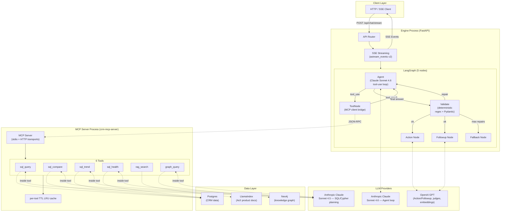
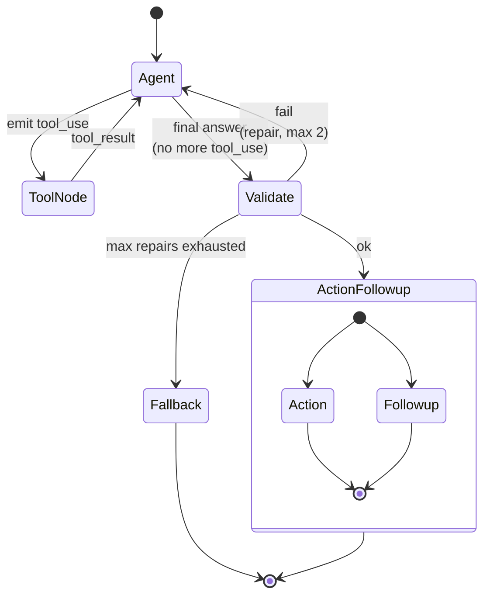

# Architecture

This document describes the system architecture of the CRM Agentic Reasoning Engine.

## Overview

The system is a **LangGraph ReAct (Reason+Act) tool-use agent** backed by a **standalone MCP server**. Two processes, one product:

- **Engine** — FastAPI + LangGraph + Claude Sonnet 4.6 — runs the agent loop, validates outputs, generates terminal-node responses (Action + Followup)
- **MCP server** (`crm-mcp-server`) — Python + JSON-RPC over stdio/HTTP — exposes 6 JSON-Schema-contracted tools over Postgres, LlamaIndex, and Neo4j

The same MCP server is independently demoable in Claude Desktop via stdio — same protocol, two consumable surfaces from one codebase.

## System Diagram



## Agent Pipeline

The engine uses LangGraph to orchestrate a **5-node ReAct + Reflexion pipeline**:



### ReAct loop (inner)

Yao et al. 2022 — "ReAct: Synergizing Reasoning and Acting in Language Models."

The agent **reasons** about the user question, **acts** by emitting tool_use blocks, **observes** the tool results, then reasons again. Bounded at 6 turns per question. Multi-source decomposition emerges naturally from parallel tool_use blocks.

**Edge logic** (`should_continue_after_agent`):
- If the last AI message has `tool_calls` AND `turn_count < MAX_TURNS` → route to ToolNode
- Otherwise → route to Validate

At `turn_count >= MAX_TURNS` the agent is force-routed to Validate with whatever evidence has been gathered. Inside `agent_node`, the LLM is invoked WITHOUT bound tools when force-synthesizing, so it cannot emit another tool_use even if it wanted to.

### Reflexion loop (outer)

Shinn et al. 2023 — "Reflexion: Language Agents with Verbal Reinforcement Learning."

After the agent produces a final answer, the deterministic Validate gate checks it. On failure, a structured critique is fed back to the agent, which revises **without tools bound**.

**Edge logic** (`should_repair`):
- `validate.ok == True` → `"ok"` (route to Action + Followup in parallel)
- `validate.ok == False` AND `repair_count < MAX_REPAIRS (2)` → `"repair"` (re-invoke Agent with critique)
- Else → `"fallback"` (write a degraded honest answer from collected citations, route to END)

### Node Responsibilities

#### Agent (`backend/agent/agent_node/`)

**Purpose**: LLM tool-use loop using LangChain `ChatAnthropic` + `bind_tools()`.

**Components**:
- `system_prompt.py` — `SYSTEM_PROMPT_CACHED`, the cache-stable prompt body with tool guidance, anti-examples, no-tool path for meta questions, cross-source synthesis rules, evidence-tag contract
- `node.py` — `agent_node()` invocation, cache_control wiring, repair-time tool-unbinding, fallback-node output
- `tool_invoker.py` — bridges Anthropic tool_use blocks → MCP client calls

**Key design choices**:
- **Prompt caching** on the system content block + last tool definition (Anthropic ephemeral cache, 5-min TTL) — cuts agent loop token cost ~85% across multi-turn loops
- **Today's date** is NOT in the cached system prompt (would bust cache daily); instead injected as a non-cached `(Today: 2026-MM-DD)` human-message prefix per request
- **Repair mode** invokes the bare LLM (no `bind_tools()`) so the model physically cannot emit another tool_use during repair
- **MAX_TURNS = 6** (covers 3 sources × 2 attempts)

#### ToolNode (`backend/agent/mcp_client/`)

**Purpose**: thin proxy from the agent's `tool_call` to the MCP server.

**Components**:
- `client.py` — `MCPClient` (sync httpx; JSON-RPC POST to `/mcp`) + `mcp_tool_node` LangGraph node bridge
- `tools_schema.py` — static mirror of the 6 tool JSON Schemas (kept here for prompt-cache stability + zero-startup `tools/list` round-trip)

For each `tool_use` block in the agent's last message:
1. POST `tools/call` to MCP server with name + args
2. Parse `{result, citations, debug}` from the response
3. Append a `ToolMessage` to state messages
4. Append a `ToolCallRecord` to `state["tool_calls"]`
5. Merge new citations into `state["available_citations"]` (id → Citation dict)
6. Rebuild `state["sql_results"]` (back-compat shape for Action + Followup nodes)
7. Increment `state["turn_count"]`

#### Validate (`backend/agent/validate/deterministic.py`)

**Purpose**: deterministic gate enforcing the evidence-tag contract on the agent's final answer.

**Checks** (all O(n), sub-millisecond):
1. **Structure**: Answer + Evidence sections parse via regex
2. **Tag presence**: extract `[E#]/[D#]/[G#]` tags from Answer body and Evidence body
3. **Cross-check**: every tag in Answer must exist in `state["available_citations"]` (no invented ids); every tag in Evidence must exist too
4. **No naked claims**: every sentence in Answer (≥ 5 words, excluding "Data not available" / "Clarifying question" connectors) must contain at least one tag

**Meta path**: when `available_citations` is empty (the agent didn't fire any tools — meta question or clarification), the naked-claim scan is skipped. There's nothing to cite, so capability/clarification answers pass without forced tags.

**Repair prompt builder**: on failure, generates a structured critique:
```
Your previous answer failed validation:
- Missing citations: E9 (cited in Answer but no tool returned it)
- Invalid citations: D9 (in Evidence but not in available citations)
- Naked claims:
  - "Acme is at risk according to recent activity"

The ONLY citations you may use are: E1, E2, G1.

Rewrite the answer. Do NOT call more tools — use what you have.
If a claim cannot be tagged, remove it or move it to 'Data not available'.
```

**Fallback message** (after MAX_REPAIRS exhausted):
```
I couldn't ground a complete answer from the evidence I gathered. Here's what I found:
- [E1] activities WHERE company='Acme' AND type='AMA' (3 rows)
- [G1] (Maria)-[:BOARD]->(TechBoard)<-[:BOARD]-(Globex VP)
```

#### Action (`backend/agent/action/`)

**Purpose**: suggest an actionable next step from the validated answer. Unchanged from earlier system.

**Output**: 1-4 action suggestions (or `NONE` if not applicable).

#### Followup (`backend/agent/followup/`)

**Purpose**: generate 3 follow-up questions. Two-tier strategy:
1. Hardcoded question tree (fast, deterministic) — used when the original question matches a tree path
2. LLM fallback (`generate_follow_up_suggestions`) — schema-aware question generation when the tree doesn't match

**Output**: exactly 3 follow-up questions, each under 10 words.

#### Fallback (`backend/agent/agent_node/node.py::fallback_node`)

**Purpose**: write a degraded but honest answer when MAX_REPAIRS exhausted. Lists every `available_citation` verbatim under "Evidence" and emits the standard fallback message under "Answer."

## The 6 Tools (MCP server side)

Each tool returns the uniform shape:

```python
class ToolResult(BaseModel):
    result: Any                         # tool-specific payload
    citations: list[Citation] = []      # E#/D#/G# prefixed
    debug: ToolDebug = ToolDebug()      # query, row_count, latency_ms, cache_hit
    error: str | None = None
```

### sql_query

**Signature**: `sql_query(question: str, conversation_history: str = "") -> ToolResult`

**Flow**: Claude Sonnet 4.5 plans Postgres SQL → sqlglot AST guard validates (blocks writes, auto-injects `LIMIT 1000`) → Postgres execution → rows + `E#` citations. Single retry on failure with `previous_error` fed back to planner.

### sql_compare

**Signature**: `sql_compare(question: str, entity_a: str = "", entity_b: str = "", conversation_history: str = "") -> ToolResult`

**Flow**: regex extracts entities from question if not supplied → plans + executes SQL for each side in parallel → computes per-numeric-column `{sum_a, sum_b, diff, percent_change}` → returns structured `comparison` payload.

The deterministic math (% change, diff) stays in the tool — LLMs are unreliable at arithmetic over JSON rows.

### sql_trend

**Signature**: `sql_trend(question: str, granularity: str = "", conversation_history: str = "") -> ToolResult`

**Flow**: detects granularity from question keywords (daily/weekly/monthly/quarterly/yearly) → enhances question with explicit time grouping → plans + executes SQL → computes per-numeric-column `{direction, percent_change, volatility, period_changes, first/last/min/max/avg}`.

### sql_health

**Signature**: `sql_health(account: str = "", conversation_history: str = "") -> ToolResult`

**Flow**: extracts account name → fetches deal + activity data via SQL planner → computes weighted 6-factor score with components:

| Factor | Weight | Description |
|---|---|---|
| Deal Value | 25% | Total value (log scale) |
| Deal Count | 15% | Number of deals |
| Win Rate | 20% | Won / closed |
| Activity Recency | 15% | Days since last activity |
| Pipeline Coverage | 15% | Open vs closed ratio |
| Renewal Status | 10% | Upcoming renewals |

Returns `{score, grade (A-F), components, deal_metrics, activity_metrics, insights}`.

### rag_search

**Signature**: `rag_search(query: str, top_k: int = 5) -> ToolResult`

**Flow**: wraps `retrieve_and_answer` from the ported `rag/retriever.py`. Uses the production config `vector_top10_rerank5` (LlamaIndex hybrid + SentenceTransformer reranker), selected via the RAG Comparison Pipeline.

The `top_k` parameter is exposed so the agent can broaden retrieval when evidence is thin (typically bumps `top_k=5` → `top_k=10`).

### graph_query

**Signature**: `graph_query(question: str, hop_depth: int = 2, conversation_history: str = "") -> ToolResult`

**Flow**: Claude Sonnet 4.5 plans Cypher (with hop_depth>2 hint when caller passes higher) → read-only guard validates (blocks `CREATE/DELETE/DETACH/SET/REMOVE/MERGE/DROP/CALL/FOREACH`, auto-injects `LIMIT 1000`) → Neo4j execution → `G#` citations.

The `hop_depth` parameter is exposed so the agent can widen graph traversal when first-pass evidence is thin (typically bumps `hop_depth=2` → `hop_depth=3`).

## Why MCP (Model Context Protocol)

The choice to expose tools via a standalone MCP server (Anthropic's open protocol, JSON-RPC) instead of in-process Python functions:

| Property | What it earns |
|---|---|
| **Protocol-level contracts (JSON Schema)** | Wire-level schema drift fails loudly, not silently in Python |
| **Process isolation** | A tool crash (Neo4j hiccup, LlamaIndex OOM, sqlglot parser bug) doesn't take down the agent |
| **Industry-standard protocol** | Same server demoable in Claude Desktop, Cursor, Zed — two consumable surfaces from one codebase |
| **Independent deploy + scale** | Server can run on different hardware (e.g., GPU box for reranker) without changing the agent |
| **Auth boundary** | Server can enforce its own authz independently of the engine |
| **Testability** | Tools are testable as black-box JSON-RPC services without spinning up the agent |

**Cost**: one IPC hop per tool call (~1 ms stdio, network RTT over HTTP) plus a separate process lifecycle to manage. Both are well-amortized by per-tool TTL LRU caching.

## State Schema

```python
class AgentState(TypedDict, total=False):
    # Input
    question: str
    messages: Annotated[list, add_messages]   # LangChain message list

    # Agent loop bookkeeping
    tool_calls: list[ToolCallRecord]          # appended per tool call
    available_citations: dict[str, dict]      # id -> Citation dict
    turn_count: int                            # bounded by MAX_TURNS=6

    # Validate
    validate: dict | None                     # ValidateResult or None
    repair_count: int                          # bounded by MAX_REPAIRS=2

    # Final outputs
    answer: str
    follow_up_suggestions: list[str]
    suggested_action: str | None

    # Back-compat shim for action/followup nodes
    sql_results: dict[str, Any]               # derived from tool_calls

    error: str | None
```

The `sql_results` field is **rebuilt** at the end of every tool turn so the unchanged Action + Followup nodes (which read `state["sql_results"]`) keep working without modification.

## Streaming Architecture

SSE via `astream_events(version="v2")` — gives us token-level `text_delta` and tool-call `input_json_delta` deltas, not just node-boundary updates.

### Event types

| Event | Trigger |
|---|---|
| `fetch_start` | per `tool_use` block — `{tool, args}` |
| `fetch_progress` | per tool completion — `{tool, latency_ms, cache_hit, row_count}` |
| `data_ready` | once after all tools complete — synthesized `sql_results` |
| `answer_chunk` | per Anthropic `text_delta` token during answer streaming |
| `tool_call_delta` | per Anthropic `input_json_delta` (NEW; live tool-arg construction) |
| `validate_failed` | per failed Validate (NEW; debug/internal — `{repair_attempt, missing, invalid, naked}`) |
| `action_chunk` / `action_ready` | from Action node |
| `followup_ready` | from Followup node |
| `done` | pipeline complete — final `{answer, follow_up_suggestions, suggested_action, sql_results}` |
| `error` | error during execution |

**Frontend back-compat**: all legacy event names preserved. New events (`tool_call_delta`, `validate_failed`) are additive — the existing SSE parser silently ignores unknown event names.

## LLM Strategy

### Multi-model Design

| Task | Provider | Model | Why |
|---|---|---|---|
| **Agent tool-use loop** | Anthropic | Claude Sonnet 4.6 | Strong tool-use, parallel calls, native prompt caching |
| **SQL planning** | Anthropic | Claude Sonnet 4.5 | Precise structured SQL with fewer hallucinated columns |
| **Cypher planning** | Anthropic | Claude Sonnet 4.5 | Same structured-output advantage |
| **Action suggestions** | OpenAI | GPT-5.4-nano | Simple creative output, low cost |
| **Followup generation** | OpenAI | GPT-5.4-nano | Question generation, low cost |
| **Answer/Action/Followup judges (eval)** | OpenAI | GPT-5.4 | Structured 5-dim scoring |
| **RAG embeddings** | OpenAI | text-embedding-3-small | Vector similarity for retrieval |

## Evaluation Framework

60 grounded questions covering every tool path; RAGAS metrics on the final answer; LLM-as-Judge on Action + Followup quality; tool-pick accuracy as a first-class SLO.

### Integration Eval SLOs

| Metric | Threshold |
|---|---|
| Pass rate | ≥ 0.95 |
| Faithfulness (RAGAS) | ≥ 0.85 |
| Answer relevancy (RAGAS) | ≥ 0.85 |
| Answer correctness (RAGAS) | ≥ 0.35 (lenient — phrasing-sensitive) |
| Tool-pick accuracy | ≥ 0.85 |
| p50 latency (warm cache) | ≤ 3000 ms |
| p95 latency | ≤ 8000 ms |

### Follow-up Eval SLOs

| Metric | Threshold |
|---|---|
| Pass rate | ≥ 0.80 |
| Question relevance | ≥ 0.60 |
| Answer grounding | ≥ 0.50 |
| Diversity | ≥ 0.50 |
| Answerability | ≥ 0.70 |

### Regression Gate

`python -m backend.eval.integration.gate --baseline baseline.json`

- Pass rate: allow 2% drop from baseline
- Quality metrics: allow 5% drop
- Latency: allow 20% increase
- Exit code 0 = green; 1 = SLO failure or regression detected

## Safety

### SQL Safety Guard (`crm_mcp_server/sql/guard.py`)

```python
FORBIDDEN_STATEMENTS = {exp.Insert, exp.Update, exp.Delete, exp.Drop,
                        exp.Create, exp.Alter, exp.Grant}
FORBIDDEN_FUNCTIONS = {"copy", "export", "attach", "detach",
                       "load", "install", "write_csv", "write_parquet"}
FORBIDDEN_TABLE_FUNCTIONS = {exp.ReadCSV}   # blocks file-reading TVFs
MAX_ROWS = 1000                              # auto-injected LIMIT
```

Implementation uses `sqlglot` AST parsing for robust matching (vs. regex which is fragile against comments, string literals, edge cases).

### Cypher Safety Guard (`crm_mcp_server/graph_rag/guard.py`)

```python
FORBIDDEN_KEYWORDS = {"CREATE", "DELETE", "DETACH", "SET", "REMOVE",
                       "MERGE", "DROP", "CALL", "FOREACH"}
MAX_RESULTS = 1000   # auto-injected LIMIT
```

Word-boundary regex (avoids false positives like `CREATED` substrings).

## Performance

### Latency Breakdown (warm cache, typical)

| Stage | Latency |
|---|---|
| Agent reasoning + tool_use emit (1 turn) | 800 ms - 1.5 s |
| MCP HTTP round-trip | ~5-15 ms |
| SQL planning (Claude) | 500-800 ms |
| SQL execution (Postgres) | 10-50 ms |
| Cypher planning (Claude) | 500-800 ms |
| Cypher execution (Neo4j) | 50-200 ms |
| RAG retrieval (LlamaIndex + reranker) | 200-500 ms |
| Final answer synthesis (agent) | 1-2 s |
| Action + Followup (parallel) | 500 ms |
| **Typical single-source p50** | **2-3 s** |
| **Typical cross-source p50** | **5-8 s** |

### Cost Engineering

- **Prompt caching** on agent loop reduces token cost ~85% across multi-turn loops within Anthropic's 5-min ephemeral cache window
- **Per-tool TTL LRU cache** (60s SQL/Graph, 300s RAG, 30s health) eliminates redundant tool execution during repair loops and across same-session questions
- **Multi-tier model strategy** — Sonnet 4.5 inside tools (fewer required tokens), Sonnet 4.6 only at agent loop, nano models for terminal nodes

## Observability

All agent turns, tool calls, and Validate results emit LangSmith traces with custom metadata:

| Span | Metadata |
|---|---|
| `agent_turn` | turn_number, tool_picks, model, tokens_in/out |
| Each tool call | name, cache_hit, latency_ms, row_count, error |
| `validate` | ok, repair_attempt, missing_tags, invalid_tags, naked_claims |
| Action / Followup | model, contract_result (was_repaired / used_fallback), tokens |

The MCP server also exposes `/metrics/cache` for cache hit/miss telemetry per tool.

## CI/CD Pipeline

### CI (GitHub Actions)

Two workflows protect `main`:

- **Engine** (`backend.yml`) — ruff + mypy + pytest (agent + core + e2e) + coverage upload (Codecov, non-blocking) + quality gate (`workflow_dispatch`)
- **MCP** (`ci.yml`) — ruff + mypy + pytest (≥ 80% coverage gate) + Docker build + GHCR push on `main`
- **E2E** (`e2e.yml`) — boots both services via docker-compose; runs Playwright against the engine UI

### Failure Modes

A PR or push is blocked when any of:
- Ruff E/F/W violations
- mypy errors outside `--ignore-missing-imports`
- pytest failures (agent or core)
- Coverage drop > threshold
- Quality gate: any RAGAS / judge / latency SLO below threshold
- Playwright spec failures
- MCP repo CI failures upstream (engine PR depends on a fresh MCP image)

## Recommended Improvements

- Rate limiting on `/api/chat/stream`
- Audit logging for all SQL/Cypher executions (currently logs blocked queries only)
- Multi-tenancy / per-customer MCP server deployments
- Real production telemetry (currently SLOs are eval-only, not request-path)
