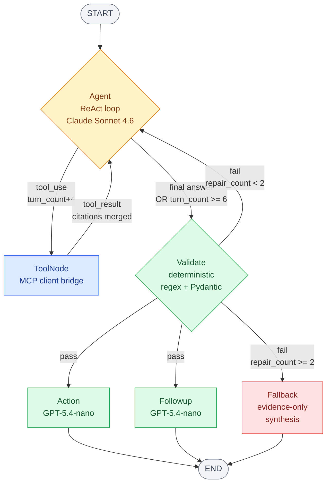

# LangGraph Diagram

Visual reference for the 5-node LangGraph + MCP server topology.

## Mermaid View



## ASCII View

```
                            ┌────────────────────────┐
                            │     User Question      │
                            └───────────┬────────────┘
                                        ▼
        ┌─────────────────────────────────────────────────────────────────┐
        │                       AGENT (ReAct loop)                       │
        │  ┌──► picks tool(s) ──► parallel when independent              │
        │  │                                                             │
        │  │    each turn: see tool_results, decide next call            │
        │  │                                                             │
        │  └──◄ loops until evidence sufficient                          │
        │                                                                │
        │         final turn = answer with [E#]/[D#]/[G#] tags           │
        └─────┬───────────────────────────────────────────────┬─────────┘
              │ tool_call                                     │ final answer
              ▼                                               │
        ┌──────────────┐                                      │
        │  TOOLNODE    │  ◄─── tool_result ─────┐             │
        │ (MCP client) │                        │             │
        └──────┬───────┘                        │             │
               │ JSON-RPC                       │             │
               ▼                                │             │
   ╔═════════════════════════════════════════╗  │             │
   ║          MCP SERVER (sibling process)   ║  │             │
   ╠═════════════════════════════════════════╣  │             │
   ║                                         ║  │             │
   ║   ┌─────────────┬─────────────┬──────┐  ║  │             │
   ║   ▼             ▼             ▼      │  ║  │             │
   ║ sql_query   rag_search   graph_query │  ║  │             │
   ║ sql_compare                          │  ║  │             │
   ║ sql_trend                            │  ║  │             │
   ║ sql_health                           │  ║  │             │
   ║   │             │             │      │  ║  │             │
   ║   ▼             ▼             ▼      │  ║  │             │
   ║ Postgres     LlamaIndex      Neo4j     │  ║  │             │
   ║   │             │             │      │  ║  │             │
   ║   └─────────────┴─────────────┘      │  ║  │             │
   ║              │                       │  ║  │             │
   ║  {result, citations, debug}          │  ║  │             │
   ║              │                       │  ║  │             │
   ╚══════════════╪═══════════════════════╝  │  │             │
                  │  tool_result               │  │             │
                  └────────────────────────────┘  │             │
                                                  │             │
                                                  ▼             ▼
                                          ┌──────────────────┐
                                   ┌─────►│     VALIDATE     │
                                   │      │  - tags present? │
                                   │      │  - tags valid?   │
                                   │      │  - no naked?     │
                                   │      └────────┬─────────┘
                                   │               │
                                   │  fail         │  pass
                                   │  (max 2)      │
                                   │               │
                                   │     ┌─────────┴──────────┐
                                   │     │                    │
                                   │     ▼                    ▼
                                   │  ┌──────┐           ┌────────┐
                                   │  │ACTION│           │FOLLOWUP│
                                   │  └──┬───┘           └────┬───┘
                                   │     │                    │
                          repair         │                    │
                          re-prompt      └────────┬───────────┘
                          back to                 │
                          Agent                   ▼
                                   │             (END)
                                   │
                                   └──── after MAX_REPAIRS:
                                         fallback evidence-only answer → END
```

## Node Inventory

| Node | Function | Inputs | Outputs |
|---|---|---|---|
| **Agent** | `agent_node()` | `messages`, `tool_calls`, `validate`, `repair_count`, `question` | `messages` (AIMessage), `turn_count++`, `answer` (on final turn), `repair_count++` (on repair) |
| **ToolNode** | `mcp_tool_node()` | last AIMessage's `tool_calls` | `messages` (ToolMessage), `tool_calls[]`, `available_citations{}`, `sql_results{}`, `turn_count++` |
| **Validate** | `validate_node()` | `answer`, `available_citations` | `validate` (ValidateResult dict) |
| **Action** | `action_node()` | `question`, `answer` | `suggested_action` |
| **Followup** | `followup_node()` | `question`, `answer`, `messages`, `sql_results` | `follow_up_suggestions` |
| **Fallback** | `fallback_node()` | `available_citations` | `answer` (degraded evidence-only) |

## Edge Functions

### `should_continue_after_agent(state) -> str`

Decides whether to dispatch tools or proceed to Validate.

```python
def should_continue_after_agent(state) -> str:
    last = state["messages"][-1]
    if (
        isinstance(last, AIMessage)
        and getattr(last, "tool_calls", None)
        and state.get("turn_count", 0) < MAX_TURNS    # MAX_TURNS = 6
    ):
        return "tools"
    return "validate"
```

### `should_repair(state) -> str`

Decides what to do after Validate. Conditional fan-out: on `"ok"` it returns a LIST `[ACTION, FOLLOWUP]` so LangGraph runs both in parallel.

```python
def should_repair(state) -> Any:
    v = state.get("validate") or {}
    if v.get("ok"):
        return [ACTION_NODE, FOLLOWUP_NODE]          # fan-out
    if state.get("repair_count", 0) < MAX_REPAIRS:   # MAX_REPAIRS = 2
        return AGENT_NODE                            # repair loop
    return FALLBACK_NODE                             # cap reached
```

## Checkpointing

The graph compiles with `PostgresSaver`:

```python
return g.compile(checkpointer=PostgresSaver(...))
```

Each session uses a UUID `thread_id` for state persistence across turns. State is durable — checkpoints survive engine restarts and are shared across multiple instances.

## Comparison vs. Earlier Design

| | Earlier (8 nodes) | Current (5 nodes) |
|---|---|---|
| Routing | Heuristic supervisor → fixed dispatch | Agent LLM tool-use loop |
| Data sources | 3 specialized nodes (SQL, RAG, Graph) | 1 ToolNode → 6 MCP tools |
| Cross-source | Hardcoded Planner with typed sub-queries | Emerges from parallel tool calls |
| Refetch | Custom `_route_after_answer` routing | Agent calls tool with adjusted args |
| Validation | LLM-based grounding verifier | Deterministic regex + Pydantic |
| Process model | All in-process Python | Engine + standalone MCP server |
| Code surface | ~40% more orchestration code | Smaller, simpler |
