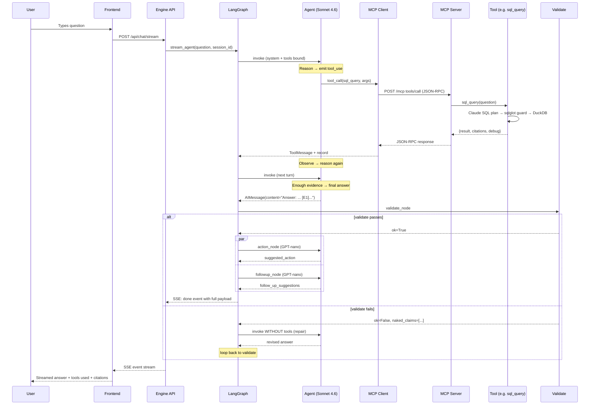

# Data Flow

Stage-by-stage request lifecycle through the engine + MCP server.

## High-Level Sequence



## SSE Event Sequence (typical cross-source question)

For a question like *"Acme's pipeline + how Act! tracks deal stages"* that fires SQL + RAG in parallel:

```
1.  event: tool_call_delta   data: {tool: "sql_query",   args_delta: "{"}
2.  event: tool_call_delta   data: {tool: null,          args_delta: "\"questi"}
3.  event: tool_call_delta   data: {tool: null,          args_delta: "on\": \"Acme"}
4.  event: tool_call_delta   data: {tool: null,          args_delta: " pipeline\"}"}
5.  event: tool_call_delta   data: {tool: "rag_search",  args_delta: "{"}
6.  event: tool_call_delta   data: {tool: null,          args_delta: "\"query\":"}
7.  event: tool_call_delta   data: {tool: null,          args_delta: " \"Act! deal"}
8.  event: tool_call_delta   data: {tool: null,          args_delta: " stages\"}"}
9.  event: fetch_start       data: {tool: "sql_query",   args: {question: "Acme pipeline"}}
10. event: fetch_start       data: {tool: "rag_search",  args: {query: "Act! deal stages"}}
11. event: fetch_progress    data: {tool: "sql_query",   latency_ms: 1715, cache_hit: true, row_count: 11}
12. event: fetch_progress    data: {tool: "rag_search",  latency_ms: 850,  cache_hit: false, row_count: 5}
13. event: data_ready        data: {sql_results: {data: [...], rag_answer: "...", rag_sources: [...]}}
14. event: answer_chunk      data: {chunk: "Answer"}
15. event: answer_chunk      data: {chunk: ": Acme has 2 open pipeline deals"}
16. event: answer_chunk      data: {chunk: " totalling $39,000 USD..."}
... (many answer_chunk events streaming text) ...
40. event: action_ready      data: {suggested_action: "Schedule a check-in with Acme"}
41. event: followup_ready    data: {follow_up_suggestions: ["What are Acme's other risks?", ...]}
42. event: done              data: {answer: "...", follow_up_suggestions: [...], suggested_action: "...", sql_results: {...}}
```

## Single-Source Example

**Question**: "How many companies are Active?"

```
1. Agent receives question
2. Agent reasons: "single-source lookup → sql_query"
3. Agent emits: tool_call(sql_query, {question: "How many companies are Active?"})
4. MCP client → MCP server → sql_query tool
5. Tool: Claude plans → SELECT COUNT(*) FROM companies WHERE status='Active'
6. Guard: sqlglot validates, auto-injects LIMIT 1000
7. DuckDB: executes, returns [{active_company_count: 6}]
8. Tool returns: {result: [{active_company_count: 6}], citations: [{id: "E1", source: "sql", excerpt: "{active_company_count: 6}"}]}
9. Agent observes → reasons → "enough; final answer"
10. Agent emits final text: "Answer: There are 6 Active companies in the CRM [E1].\nEvidence:\n- [E1] {active_company_count: 6}"
11. Validate: passes (single tag, valid, no naked claims)
12. Action + Followup run in parallel
13. SSE: done event with full payload
```

**Total agent turns**: 2 (one tool call, one final answer).

## Multi-Source Example

**Question**: "Acme's pipeline + how does Act! track deal stages?"

```
1. Agent emits PARALLEL tool calls in one turn:
   - tool_call(sql_query, {question: "Acme pipeline deals"})
   - tool_call(rag_search, {query: "Act! deal stages"})
2. ToolNode dispatches both, collects results:
   - sql_query: returns 2 deals + E1, E2 citations
   - rag_search: returns doc snippet + D1 citation
3. Agent observes BOTH results in next turn
4. Agent reasons: "I have SQL data and RAG context; weave into one answer"
5. Agent emits final text with cross-source synthesis:
   "Answer: Acme has 2 open deals [E1][E2] in the Proposal and Qualified stages,
    which Act! defines as [D1]... Acme's $24K renewal is at risk because Qualified
    stages typically need..."
6. Validate: passes
7. Action + Followup
8. SSE: done
```

**Total agent turns**: 2 (parallel tool calls in one turn, final answer in second).
**Total tools fired**: 2.

## Refetch Example (Agent self-broadens)

**Question**: "What does Act! say about advanced campaign segmentation?"

```
Turn 1: Agent emits tool_call(rag_search, {query: "advanced campaign segmentation", top_k: 5})
        Returns: 5 chunks, low confidence (avg score 0.4)

Turn 2: Agent observes thin evidence; decides to broaden
        Emits: tool_call(rag_search, {query: "advanced campaign segmentation", top_k: 10})
        Returns: 10 chunks, better confidence (avg score 0.7)

Turn 3: Agent emits final answer with D1-D5 citations from the broader pull
```

**Tools fired**: 2 (same tool, different `top_k`).
**Decision driver**: agent observed thin evidence and self-broadened.

No external "refetch_target" routing logic — the agent simply calls the tool again with adjusted args. Cleaner than the earlier `_route_after_answer` dispatch.

## Reflexion Repair Example

**Question**: "Show pipeline + recommend who to contact at Acme"

```
Turn 1: Agent emits PARALLEL tool calls:
        - sql_query("Acme pipeline")
        - graph_query("Acme contacts and roles")

Both return: SQL returns 2 deals (E1, E2); graph returns 3 contacts (G1, G2, G3)

Turn 2: Agent emits final answer:
        "Answer: Acme has 2 open deals [E1][E2]. Recommended contact: Jane Doe (VP Sales)
         [G1]. She's connected to your account manager [G4]. Acme's renewal is at risk."

Validate runs:
- Structure: passes
- Tags in Answer: {E1, E2, G1, G4}
- available_citations: {E1, E2, G1, G2, G3}
- MISSING: G4 (cited but not returned by graph_query)
- NAKED CLAIM: "Acme's renewal is at risk" (no tag)

Validate result: ok=False
should_repair: repair_count (0) < MAX_REPAIRS (2) → "repair"

Reflexion turn (Agent invoked WITHOUT tools bound):
Critique prepended as HumanMessage:
  "Your previous answer failed validation:
   - Missing citations (cited but no tool returned them): G4
   - Naked claims: 'Acme's renewal is at risk'
   The ONLY citations you may use are: E1, E2, G1, G2, G3.
   Rewrite the answer..."

Agent revises:
  "Answer: Acme has 2 open deals [E1][E2]. Recommended contact: Jane Doe
   (VP Sales) [G1].
   Data not available: connections from Jane Doe to your account manager
   (graph_query did not return that path)."

Validate runs again: passes.
Action + Followup run.
```

**Total turns**: 4 (2 ReAct + 1 revised answer + Validate-passes).
**Reflexion fired**: 1 repair.

## State Transitions

```
state = {question: "...", messages: [HumanMessage(...)]}
                    │
                    ▼
agent_node          → state["messages"].append(AIMessage with tool_calls)
                      state["turn_count"] = 1
                    │
                    ▼
should_continue → "tools"
                    │
                    ▼
mcp_tool_node       → state["messages"].append(ToolMessage)
                      state["tool_calls"].append({tool_name, args, result, citations, ...})
                      state["available_citations"].update({E1: {...}, E2: {...}})
                      state["sql_results"] = rebuilt({data: [...]})
                      state["turn_count"] = 2
                    │
                    ▼
agent_node          → state["messages"].append(AIMessage with final text)
                      state["answer"] = "Answer: ..."
                      state["turn_count"] = 3
                    │
                    ▼
should_continue → "validate"
                    │
                    ▼
validate_node       → state["validate"] = {ok: True, ...}
                    │
                    ▼
should_repair → ["action", "followup"]   (fan-out — both run in parallel)
                    │           │
                    ▼           ▼
action_node       followup_node
state["suggested_action"] = "..."
state["follow_up_suggestions"] = [...]
                    │           │
                    └─────┬─────┘
                          ▼
                        (END)
```

## Component Boundaries

| Layer | Lives In | Owns |
|---|---|---|
| **HTTP / SSE** | Engine — `backend/api/chat.py` | `/api/chat/stream` endpoint, request validation |
| **Streaming adapter** | Engine — `backend/agent/streaming.py` | LangGraph `astream_events(v2)` → SSE event mapping |
| **Graph orchestration** | Engine — `backend/agent/graph.py` | 5-node wiring, conditional edges, MemorySaver |
| **Agent loop** | Engine — `backend/agent/agent_node/` | LLM invocation, system prompt, repair handling |
| **MCP client** | Engine — `backend/agent/mcp_client/` | JSON-RPC client, ToolNode bridge, citation merging |
| **Tool registry** | MCP server — `crm_mcp_server/server.py` | Tool JSON Schemas + anti-example descriptions |
| **Tool handlers** | MCP server — `crm_mcp_server/tools/` | 6 tool implementations with `@cached_tool` decorator |
| **Tool internals** (planners, guards, executors) | MCP server — `crm_mcp_server/{sql,rag,graph_rag}/` | Claude planners, sqlglot/Cypher guards, DuckDB/Neo4j executors |
| **Action + Followup** | Engine — `backend/agent/{action,followup}/` | Post-validation terminal nodes (unchanged from earlier design) |
| **Validate gate** | Engine — `backend/agent/validate/deterministic.py` | Regex + Pydantic evidence-tag verification |
| **Eval harness** | Engine — `backend/eval/` | RAGAS + LLM-as-Judge + regression gate |
