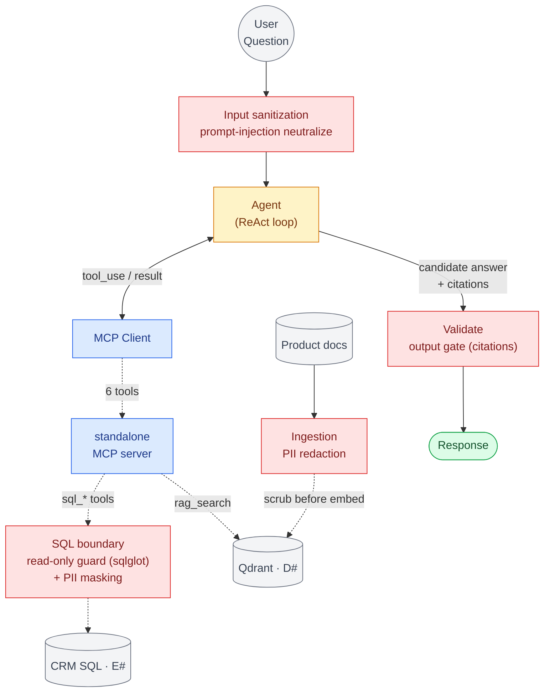

# Guardrails & PII handling — defense-in-depth

Four guardrail layers across the pipeline (red). Input is sanitized before the agent; documents are PII-scrubbed at ingestion; the SQL tool boundary enforces read-only **and** masks PII; the output passes the deterministic citation gate.

## The four layers (defense-in-depth)

| # | Layer | Where it runs | What it does |
|---|---|---|---|
| 1 | **Input sanitization** | engine, input boundary (`api/chat.py` → `sanitize.py`) | strips control chars, caps length, neutralizes prompt-injection patterns before the agent sees them |
| 2 | **Ingestion PII redaction** | MCP server (`rag/indexer.py` → `pii.scrub_text`) | scrubs embedded emails/phones/SSNs from doc text **before** it is chunked & embedded — PII never enters the vector store |
| 3 | **SQL boundary** | MCP server (`sql/executor.py` → `pii.mask_rows` + `sql/guard.py`) | read-only guard (sqlglot) blocks writes; **policy-driven PII masking** masks email/phone, scrubs free-text `notes`, before rows reach the LLM |
| 4 | **Output gate** | engine (`validate`) | deterministic citation contract — every claim grounded, no naked claims |

## Design note — why policy-driven, not blanket redaction
In a CRM, contact **names are frequently the legitimate answer** ("who's on Acme's buying committee?"). So masking is **policy-driven**: mask contact-*channel* PII (email, phone) the model never needs to reason over, scrub free-text for embedded PII, and keep names as the query subject. The policy is data, not code — flipping to default-deny (mask names too) is a one-line change. Regex-based today; the `scrub_text` / `mask_rows` seam swaps to **Microsoft Presidio** for production NER without touching callers.
