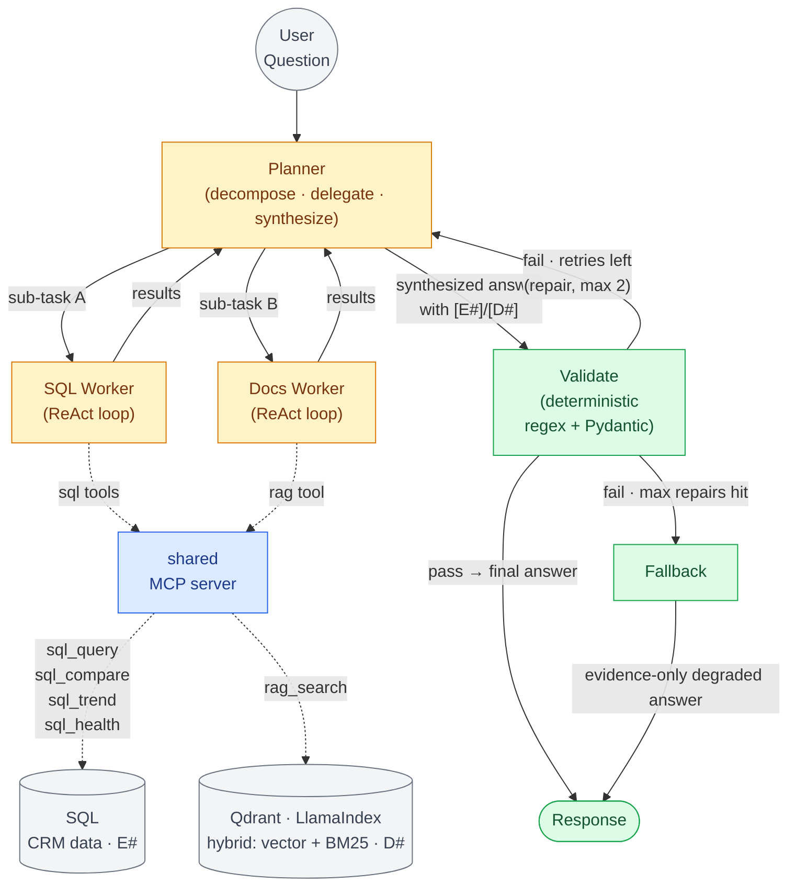
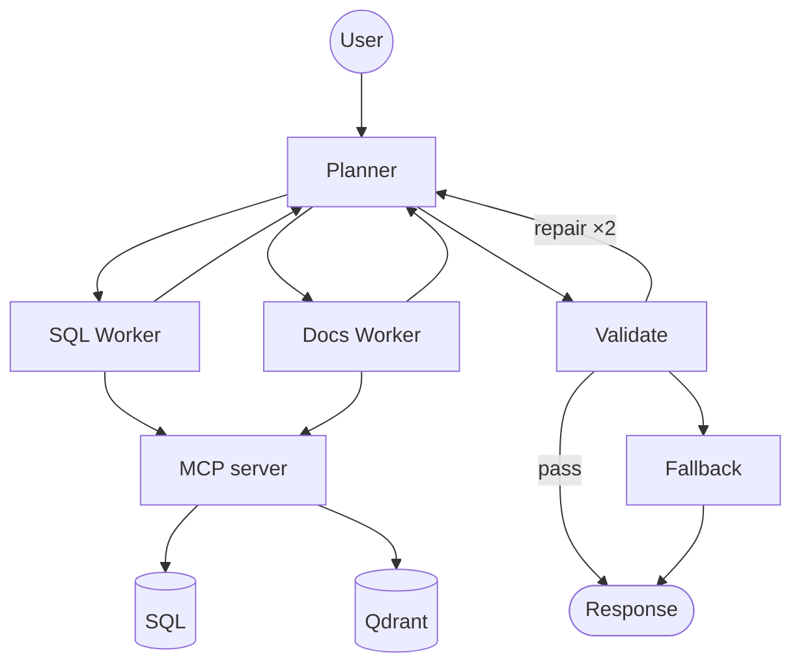

# Scratch — multi-agent variant (NOT part of the docs)

Same scaffold, expanded: a **Planner** delegates to **scoped React worker agents**, which hit the **same shared MCP server**. Guardrails (Validate → Fallback) unchanged. This is the Q18 "how I'd go multi-agent" picture.

## Full

## Skeleton (spine)

## The points this diagram makes (Q18)
- **What makes it multi-agent = multiple ReAct loops** (the workers), not the tools. Each worker is its own reasoning loop, scoped to a tool subset.
- **Planner** decomposes → delegates → synthesizes. A *router* if routing is simple; a *ReAct planner* if the plan must adapt to results.
- **Shared MCP server** = the same tool layer. Multi-agent is **additive** — add agents in front, don't rebuild the tools. (This is why the standalone MCP server makes it cheap.)
- **Same guardrails** — Validate → Fallback unchanged; the planner's synthesized answer still passes the deterministic gate.
- **When to use** — only when one agent can't reliably pick among too many tools, or the task fans out into independent deep sub-tasks. Otherwise stay single-agent.
