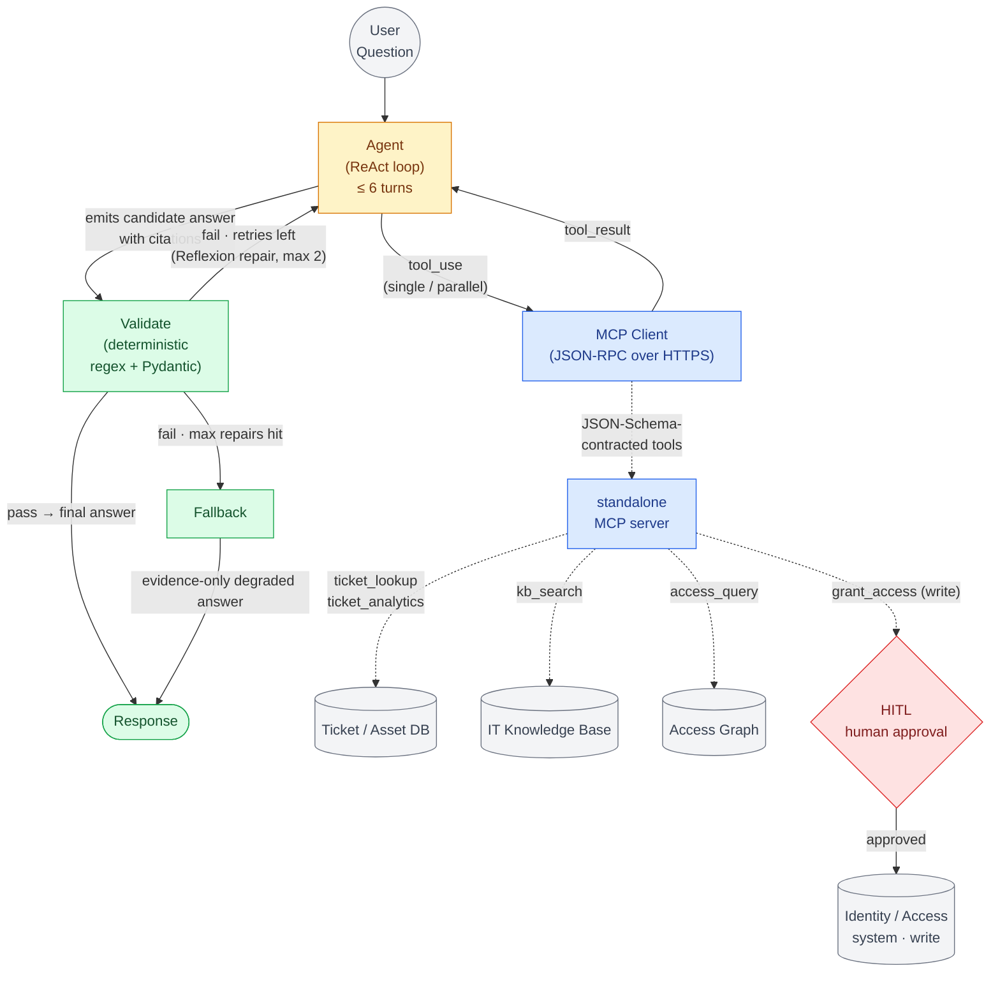
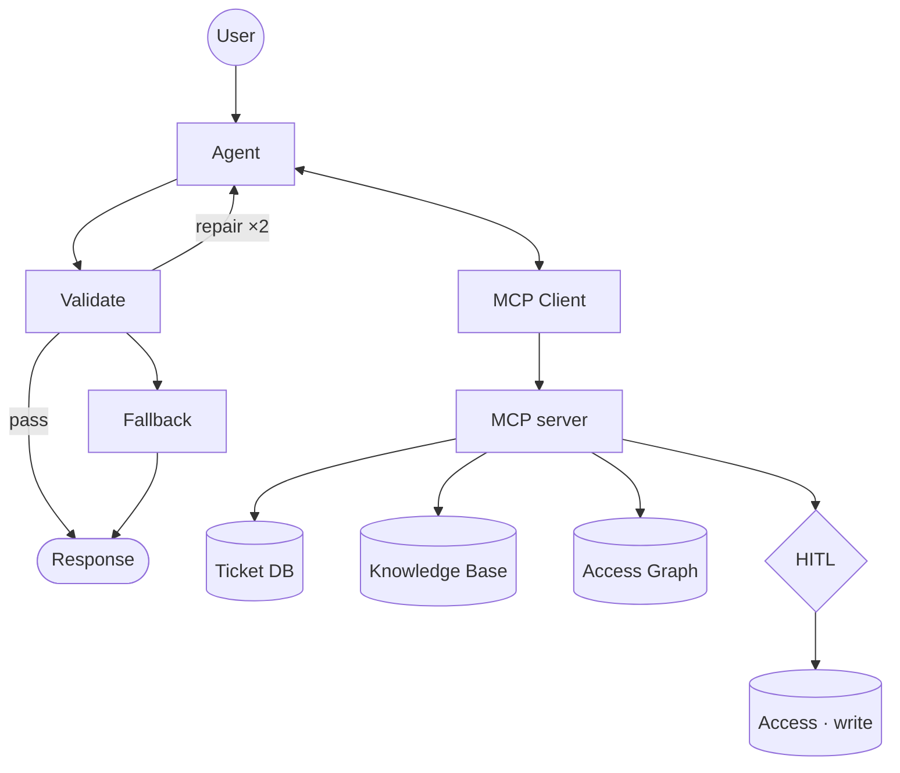

# Scratch — whiteboard practice (NOT part of the docs)

Generic agentic re-skin + HITL action tool. Same shape as the main D1 diagram, with Action/Followup dropped and an action tool gated by human approval. Example domain: IT / access copilot.

## Full

## Skeleton (spine)

**Base** = D1 minus Action/Followup, guardrails intact. **Re-skin** = swap sources/tools, split SQL into query + analytics, drop graph if no relationships. **Variation** = if it acts, add action tool → HITL → write (reads stay ungated).
