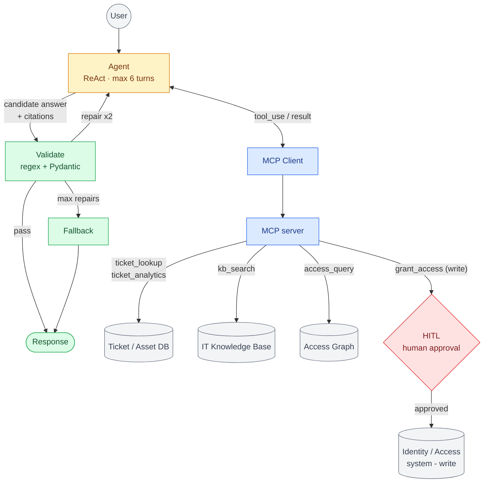

# Scratch — whiteboard practice (NOT part of the docs)

Generic agentic re-skin + HITL action tool. Example domain: IT / access copilot (answers helpdesk questions, can grant access with human approval).

**Base** = D1 minus Action/Followup, guardrails intact. **Re-skin** = swap sources/tools, split SQL into query + analytics, drop graph if no relationships. **Variation** = if it acts, add action tool -> HITL -> write (reads stay ungated).
