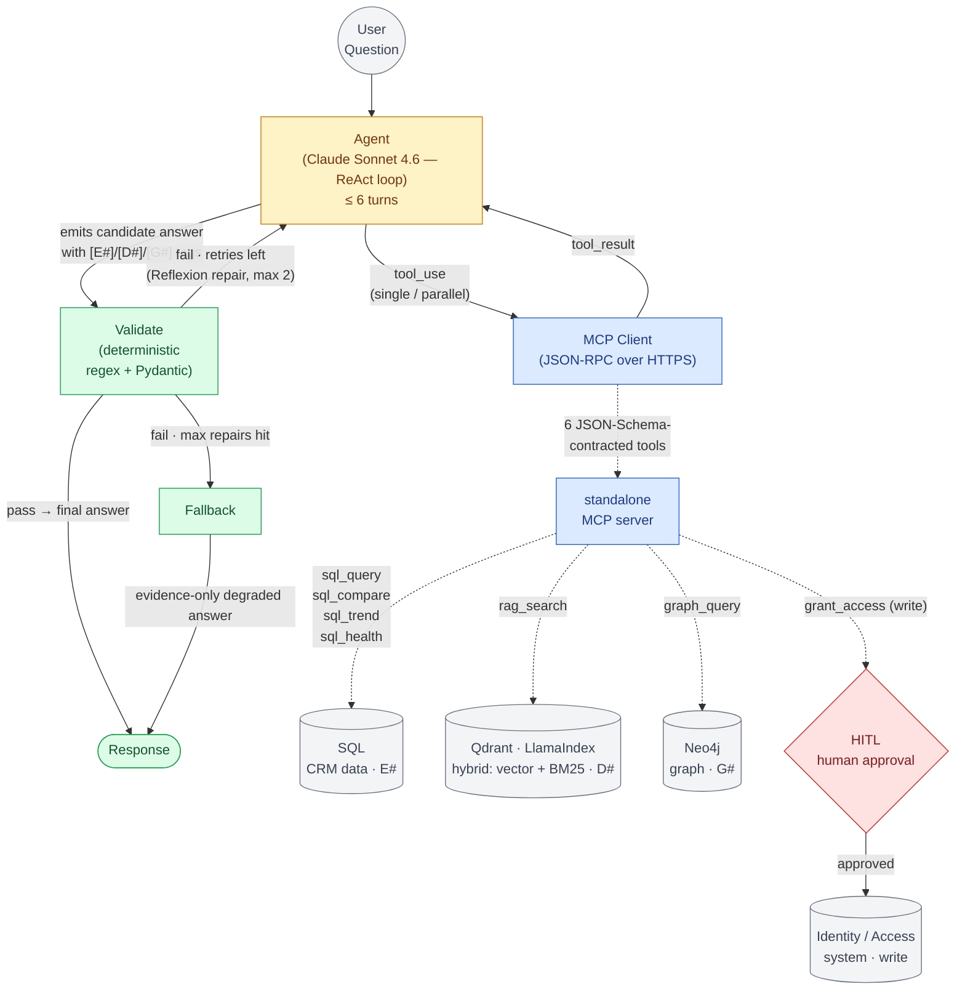
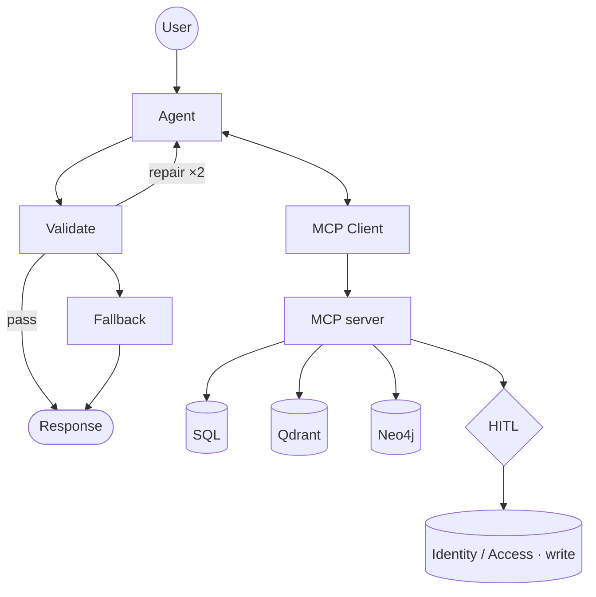

# Scratch — whiteboard practice (NOT part of the docs)

Exact same as the main D1 diagram — Action/Followup removed, HITL action tool + write target added. Nothing else changed.

## Full

## Skeleton (spine)

Only two edits vs D1: **removed** Action + Followup nodes; **added** the `grant_access` write tool → **HITL** gate → **Identity / Access · write** target. Reads stay ungated; only the write passes through the human-approval gate.
